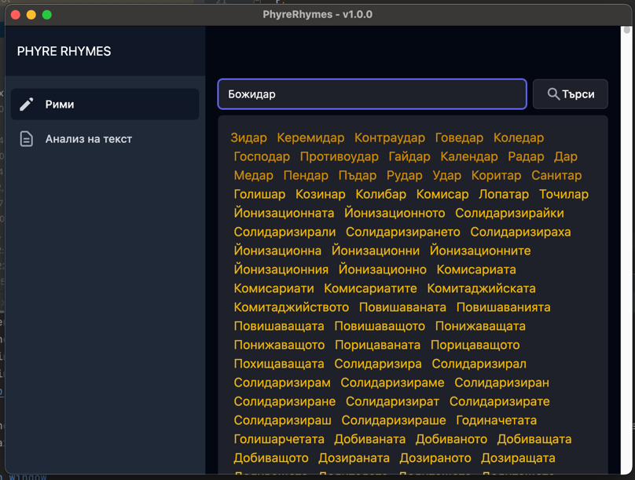
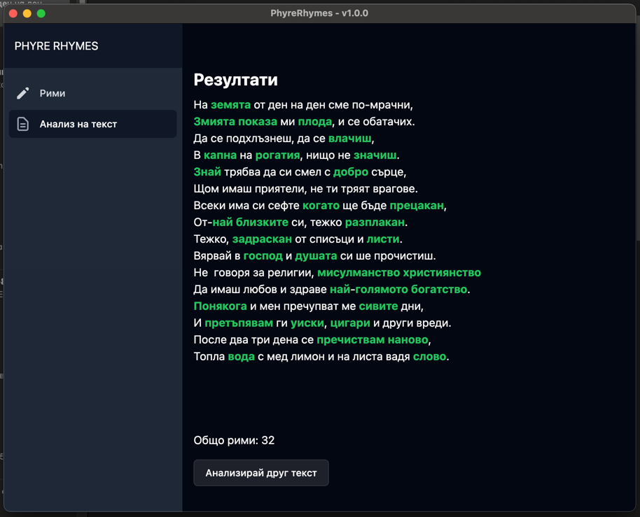

# Phyre Rhymes

Phyre Rhymes is a web application that allows users to search for a word and get a list of rhyming words. 

## Features
- Responsive design
- Search for a word and get a list of rhyming words
- Click on a rhyming word to get a list of rhyming words for that word
- Analyze whole text for rhyming words
- Unit tests for the rhyming algorithm

## Future Features
- Save rhyming words to a list
- Share rhyming words list
- Top rhyming words
- Rhyming words for different languages
- Multilingual support
- White/Dark Mode

## Screenshots

